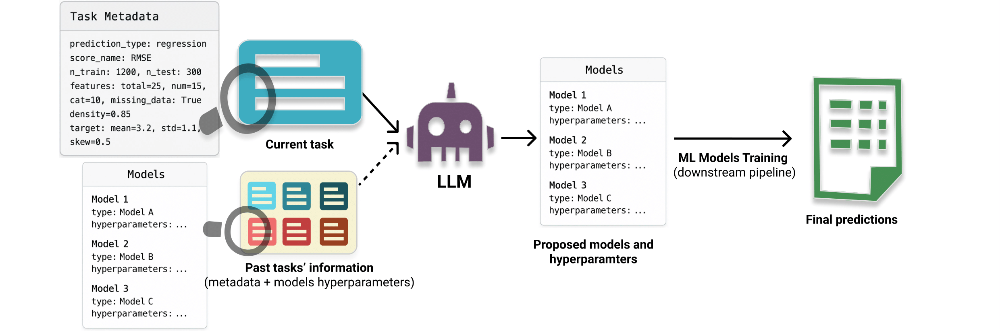
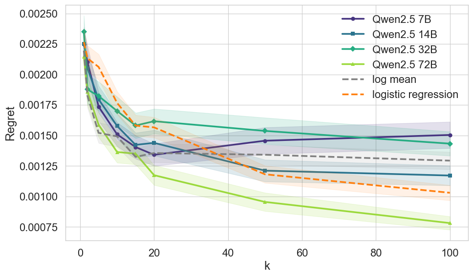
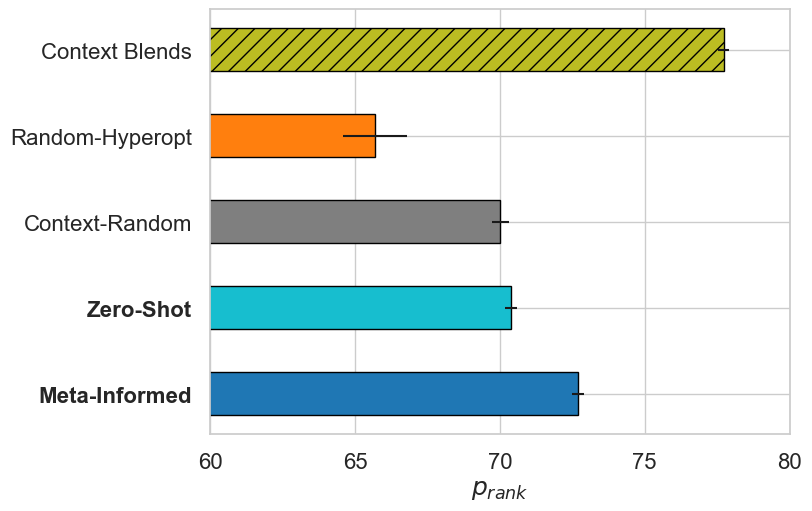

<div align="center">
  <h1>LLM-Cash</h1>

[](https://arxiv.org/abs/2402.03885)
[]()
[](https://opensource.org/license/MIT)
[]()

</div>

---

This repository contains the **official implementation** of the paper:

> **LLMs as In-Context Meta-Learners for Model and Hyperparameter Selection**

### 🧩 Abstract

Model and hyperparameter selection are critical but challenging in machine learning, typically requiring expert intuition or expensive automated search.
We investigate whether large language models (LLMs) can act as in-context meta-learners for this task.
By converting each dataset into interpretable metadata, we prompt an LLM to recommend both model families and hyperparameters.

We study two prompting strategies:

1. **Zero-shot mode** – relies solely on pretrained knowledge.
2. **Meta-informed mode** – augmented with examples of models and their performance on past tasks.

Across synthetic and real-world benchmarks, we show that LLMs can exploit dataset metadata to recommend competitive models and hyperparameters without search — highlighting a promising new role for LLMs as lightweight, general-purpose assistants for model and hyperparameter selection.



---

## ⚙️ Installation

You can set up the environment using either **Conda** or **uv**.

### 🐍 With Conda

```bash
conda create -n llm_cash python=3.12
conda activate llm_cash
pip install .
```

For development:

```bash
pre-commit install
```

---

### ⚡ With uv (Recommended)

[`uv`](https://docs.astral.sh/uv/) is a fast, modern Python package manager.

```bash
uv sync
```

Activate the environment:

```bash
source .venv/bin/activate       
```

For development:

```bash
pre-commit install
```

---

## ▶️ Running the Experiments

### 🧪 Synthetic Ridge Experiment

Evaluates how well different models — **baselines** or **LLMs** — predict the optimal ridge regularization parameter **λ** for Gaussian classification tasks.
The script outputs a **CSV file** containing metrics such as *regret*, *accuracy*, and *grid distance*.

**Baselines:**

* `mean` → predicts λ as the geometric mean of optimal values from previous tasks.
* `logistic-classifier` → trains a logistic regression model on task features to predict λ.
  These serve as non-LLM reference methods.

**Run:**

```bash
ridge-exp --model mean --rep 100 --k-grid 1,2,5,10 --dim 2 --log-dir results/
```

or

```bash
uv run ridge-exp --model qwen2.5-72b-instruct --rep 50 --k-grid 0:20:5 --dim 2 \
  --base-url https://api.deepseek.com/v1 --api-key sk-yourapikey
```

**Output:**

* Files like:

  ```
  results/records_mean_N100.csv
  results/records_qwen2.5-72b-instruct_T0.1_N50.csv
  ```
* Each row contains: `k, lambda_pred, best_lambda, regret, is_correct, grid_dist`

Reference plot:


---

### 📊 Tabular Regression / Classification

Generates model configurations for tabular tasks using an LLM.
It saves generated model specifications as JSON files.

**Run:**

```bash
generate-models --llm-model deepseek-reasoner \
                --task kaggle_abalone \
                --output-dir results/ \
                --base-url https://api.deepseek.com/v1 \
                --api-key sk-yourapikey
```

**Output:**

```
results/models.json
results/user_prompt.txt      # if --save-prompt used
results/reasoning.txt        # if --save-reasoning used
```

Reference figure (with `deepseek-r1`):




---

### 📚 Tabular Experiment Tasks and Model Classes

By default, the tabular experiment includes:

* **22 Kaggle tasks** used in the paper
* **4 model classes:** **LGBM**, **SKMLP**, **CatBoost**, and **XGBoost**

These are available under:

```
src/tabular/tasks/
src/tabular/models/
```

You can also specify your own tasks and model classes by providing alternative roots:

```bash
--tasks-dir path/to/your/tasks --models-dir path/to/your/models
```

When adding new data or models, you must provide:

* Task **metadata**
* Model **hyperparameter grids**
* *(Only for meta-informed prompting)* the **top-10 performing models JSON** for each task, used as meta-information during training

This setup makes it easy to extend the framework to new tasks, model families, and benchmarking scenarios.
---

## 🔑 Using an LLM API

**Important:**
LLM-based runs *require* a valid API endpoint and key.
Baselines (`mean`, `logistic-classifier`) do **not** require any API credentials.

### 1. Set your API key

**macOS / Linux**

```bash
export OPENAI_API_KEY="sk-yourapikey"
```

**Windows PowerShell**

```powershell
setx OPENAI_API_KEY "sk-yourapikey"
```

### 2. Specify the API endpoint

You must always provide a **custom OpenAI-compatible base URL** when using an LLM:

```bash
--base-url https://api.deepseek.com/v1 --api-key sk-yourapikey
```

### 3. Example

```bash
uv run ridge-exp --model qwen2.5-72b-instruct \
                 --base-url https://api.deepseek.com/v1 \
                 --api-key sk-yourapikey
```

```bash
uv run generate-models --task kaggle_abalone
                       --llm-model deepseek-reasoner \
                       --base-url https://api.deepseek.com/v1 \
                       --api-key sk-yourapikey
```

### Supported APIs

* **DeepSeek** (`deepseek-reasoner`)
* **Qwen** (`qwen2.5-72b-instruct`)
* any **OpenAI-compatible** endpoint

---

## 🧩 Notes

* Always provide `--base-url` and `--api-key` when running with an LLM model.
* Baselines (`mean`, `logistic-classifier`) can run offline.

---

## 📜 License

This project is released under the **MIT License**.
See the [LICENSE](LICENSE) file for details.

---

## 📚 Citing LLM-Cash

If you use this repository in your research, please cite:

```bibtex
@article{
}
```

---

💬 **Questions or feedback?**
Open an issue or contact [youssef.attiaeh@gmail.com](mailto:youssef.attiaeh@gmail.com).
