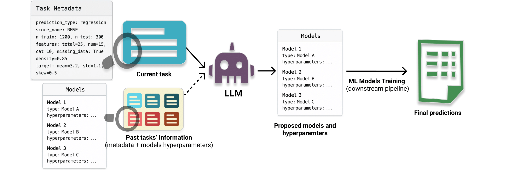

<div align="center">
<h1></h1>

[]()
[]()
[](https://opensource.org/license/MIT)
[]()

</div>

---

This repository contains the **official implementation** of the paper:  

> **LLMS AS IN-CONTEXT META-LEARNERS FOR MODEL AND
HYPERPARAMETER SELECTION**  

### Abstract  


  

---

## Installation  

🔹 **Create a conda environment**:  
```bash
conda create -n llm_cash python=3.12
```  
🔹 **Activate the environment**:  
```bash
conda activate llm_cash
```  
🔹 **Install the package**:  
```bash
pip install .
```   
🔹 **For developers** :  
```bash
pip install -e .
```  

---

## Synthetic Ridge experiment

  

## Tabular regression/classification


## License  

This project is licensed under the **MIT License**. See the [LICENSE](LICENSE) file for details.  

---

## Citing LLM_CASH

If you use this in your work, please cite **our paper**:  

```bibtex

```